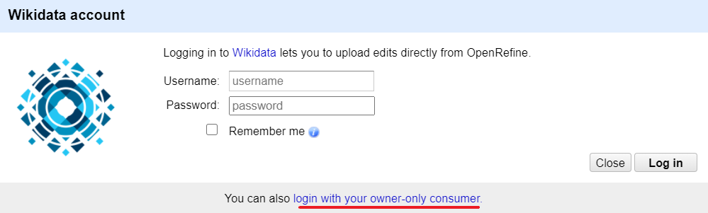
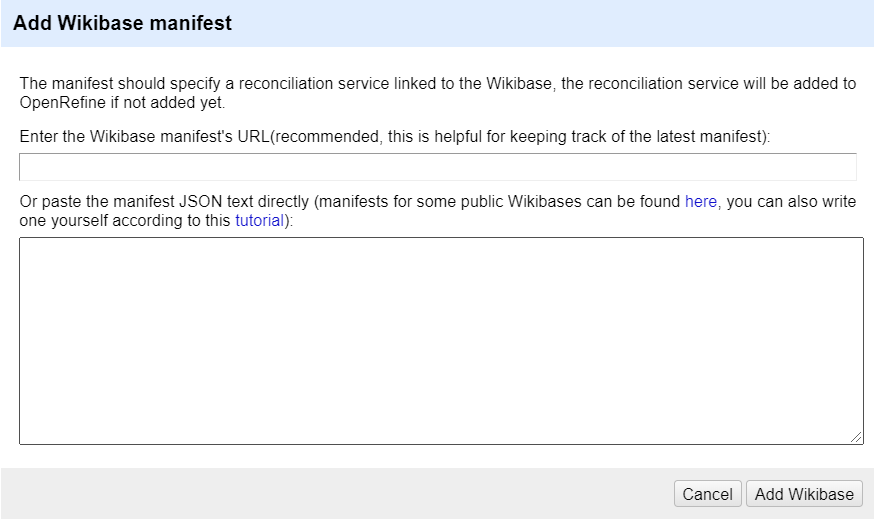
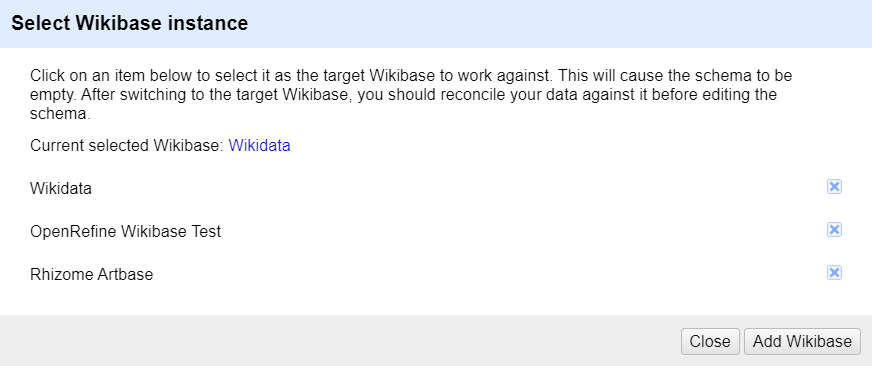

# GSoC 2020: Enhancements for Wikidata extension

During GSoC 2020, I added two features to the Wikidata extension:

1. OAuth support for Wikidata extension.
2. Extend Wikidata extension to support arbitrary Wikibase instances.

Since these two features are not quite relevant, I'll give introduce them separately.

## OAuth support

Issue: [#1612](https://github.com/OpenRefine/OpenRefine/pull/1612)

PR: [#2661](https://github.com/OpenRefine/OpenRefine/pull/2661)

### Goal

The original goal was to add three-legged OAuth support to the Wikidata extension, so users can authorize OpenRefine to upload edits to Wikidata on behalf of them without providing their usernames and passwords to OpenRefine. But considering that OpenRefine was designed to be used locally by a single user, and due to some reasons discussed under [#2661](https://github.com/OpenRefine/OpenRefine/pull/2661), we found that the three-legged OAuth support is complex and not useful. So, the goal was changed to adding two-legged OAuth support (i.e.,  supporting login with [owner-only consumer](https://www.mediawiki.org/wiki/OAuth/Owner-only_consumers)).

### Outcome

Users can now choose to login with owner-only consumer. This is helpful for the security of their Wikidata accounts.

After clicking on "login with your owner-only consumer", the user can use the consumer credentials to login in the following dialog:

### TODO

- Add three-legged OAuth support when OpenRefine introduces a use system and supports multiple users, but that's a long way to go.
- Tweak the UI of username/password login to recommend users to use [bot passwords](https://www.wikidata.org/wiki/Special:BotPasswords).

## Arbitrary Wikibase instances support

Issue: [#1640](https://github.com/OpenRefine/OpenRefine/issues/1640)

PR: [#2810](https://github.com/OpenRefine/OpenRefine/pull/2810)

### Goal

Users should be able to change the target Wikibase instance to work against, thus making it possible to upload edits to arbitrary Wikibase instances from OpenRefine.

### Outcome

Users can add Wikibase manifests in the following dialog:

As explained in the dialog, we can found manifests for some public Wikibase instances at [wikibase-manifest](https://github.com/afkbrb/wikibase-manifest). If there is no manifest for the Wikibase instance the user wants to work against, then the user can write one according to [Write-a-Wikibase-manifest](https://github.com/OpenRefine/OpenRefine/wiki/Write-a-Wikibase-manifest).

After adding some Wikibase manifests to OpenRefine, the user can select anyone to work against:

To make OpenRefine work against a given Wikibase instance, the user can simply click on the corresponding item listed in the dialog above.

After switching to the target Wikibase, users can then reconciled the data to the corresponding reconciliation services, edit the schema, login and upload edits to the target Wikibase instance, just in the same way before.

Though coding on this feature did take me a lot of time, I am glad that the UI is kept simple and user-friendly :)

### TODO

- Write more manifests for other public Wikibase instances.
- More thorough tests on this feature.

